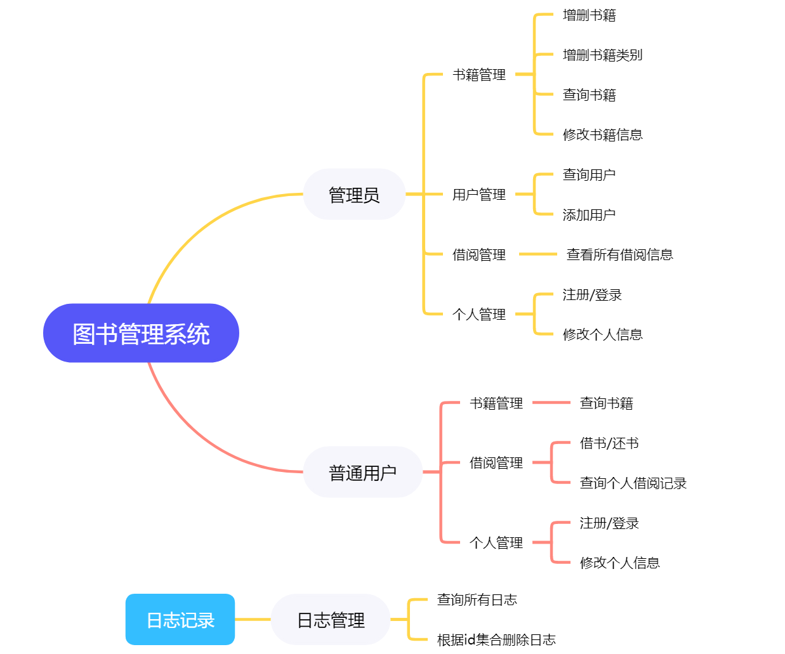
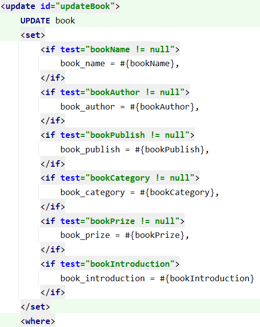
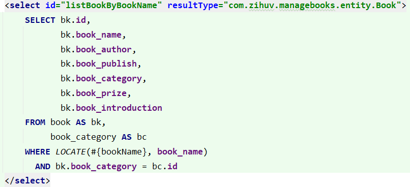
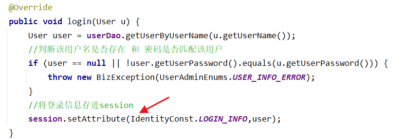
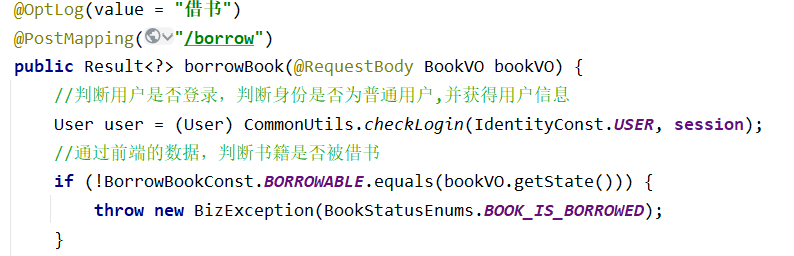
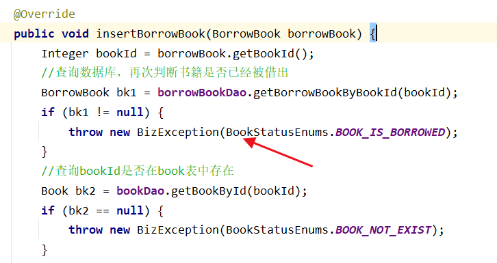
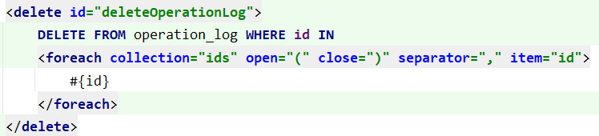
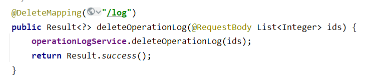
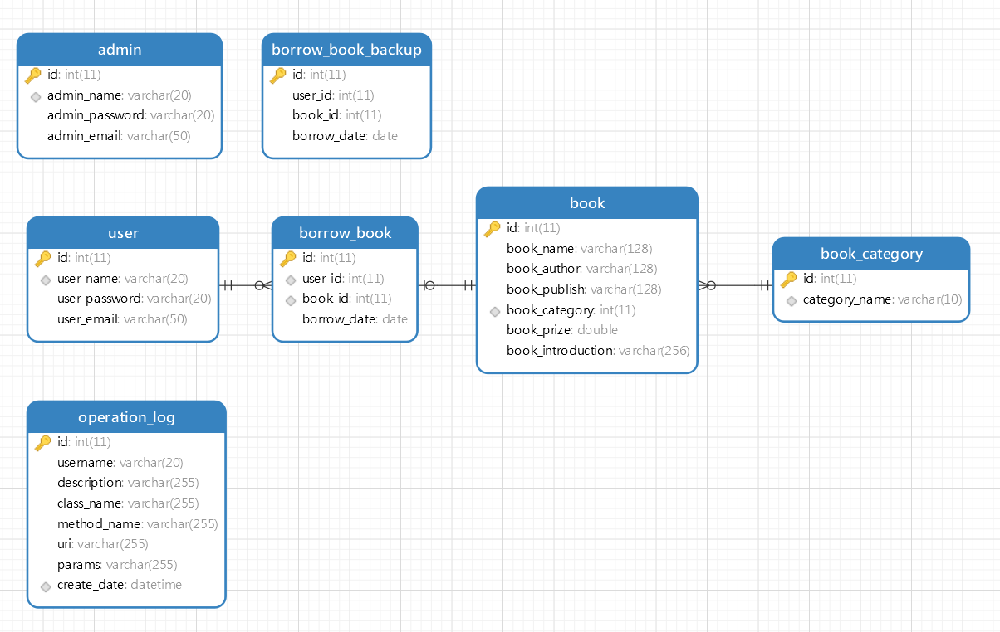

# managebooks

### 一、快速体验

1.安装MySQL，创建账号（username=root,password=1234），创建数据库managebooks，并导入doc/sql/managebooks.sql文件

2.启动jar包: `java -jar managebooks.jar` （文件路径：doc/deploy/managebooks.jar）

3.将doc/api-doc-postman/managebooks.json导入Postman，并使用Postman测试接口

### 二、技术介绍

**1.前端：** ~~大脑映射~~

**2.后端：** SpringBoot，Mybatis，druid，lombok，PageHelper

**3.开发环境：** SpringBoot 3.0.1，Java 17，Maven 3.6.1

**4.数据库：** MySQL 5.7

**5.辅助工具：** smart-doc，Postman

### 三、系统介绍

图书管理系统

#### 1.主要功能

**ps:** 由于功能较多，所以下面我将介绍一些比较典型的功能：

##### 1.1修改书籍信息

`PUT http://localhost:8080/book`

mybatis动态sql，修改给出的参数的信息，不修改未给出的参数的信息

##### 1.2根据书名查询书籍

`GET http://localhost:8080/book?bookName=三&pageNum=1&pageSize=5`

使用LOCATE函数，实现使用书籍名称进行模糊查询功能

##### 1.3登录功能

采用将登录信息存进session的方式，实现登录功能

##### 1.4借书

`POST http://localhost:8080/borrow`

判断登录状态+俩次判断书籍借阅状态（前端数据+后端数据）（目的：减少数据库的查询）

用前端所传的数据判断：

后端查询数据库在判断一次当前书籍借阅状态：

##### 1.5根据id集合删除日志

`DELETE http://localhost:8080/log`

考虑到所删除的日志可能有些多，所有选择所要删除数据的id集合作为形参，并在sql中使用动态sql

#### 2.数据库表设计

**ps:** borrow_book_backup是用于记录borrow_book中所删除的数据的表，使用触发器实现

### 四、项目特点

- 没有制作任何前端界面，但使用了Postman进行接口测试，以及由smart-doc生成接口文档
- 使用aop注解实现日志记录
- 设置了触发器。在MySQL中的borrow_book表所删除数据将自动添加在borrow_book_backup表中
- 使用枚举类和常量，尽可能减少字符串或数字直接写入代码当中，解耦
- 统一用xml文件书写sql，方便管理sql